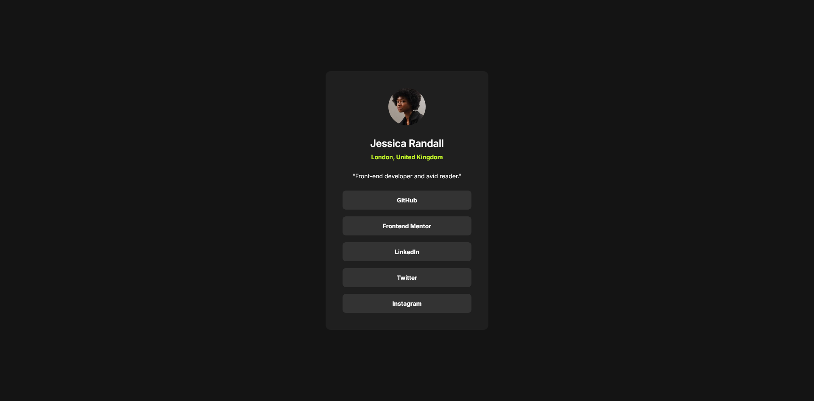

# Frontend Mentor - Social links profile solution

This is a solution to the [Social links profile challenge on Frontend Mentor](https://www.frontendmentor.io/challenges/social-links-profile-UG32l9m6dQ). Frontend Mentor challenges help you improve your coding skills by building realistic projects.

## Table of contents

- [Screenshot](#screenshot)
- [Links](#links)
- [Built with](#built-with)
- [What I learned](#what-i-learned)

### Screenshot

### Links

- Solution URL: [https://github.com/mohamed-fathy3010/FM-Social-Links](https://github.com/mohamed-fathy3010/FM-Social-Links)
- Live Site URL: [Live site URL](https://mohamed-fathy3010.github.io/FM-Social-Links/)

### Built with

- Semantic HTML5 markup
- CSS custom properties
- Flexbox
- BEM

### What I learned

I wanted to try a new css reset I saw for font-size.
